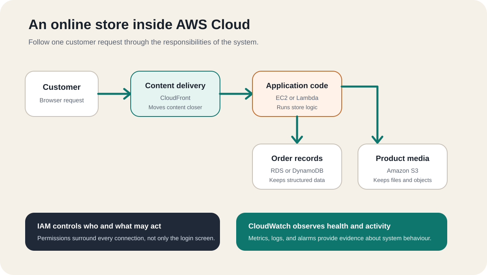

# What Is AWS Cloud?

Amazon Web Services (AWS) Cloud is a collection of technology services that
people and organisations can use over the internet instead of buying and
operating every server, storage system, database, and network themselves. You
choose the resources an application needs, configure how they work together,
and pay according to the services and capacity you use.

The difficult part for a beginner is that AWS does not look like one product.
It looks like hundreds of names, menus, and acronyms. A better starting point is
to ignore the catalogue and ask a simpler question:

> What does a real application need in order to work?

An online store needs somewhere to run its code, somewhere to keep product
images, somewhere to save orders, a way to control access, and a way to remain
available when traffic changes. AWS offers those capabilities as separate
building blocks.

## Think of AWS as a digital city

Imagine that you want to open a business in a city. You could buy land, build
every road, generate electricity, hire security, construct warehouses, and
maintain everything yourself. More realistically, you use infrastructure that
already exists and take responsibility for how your business operates inside
it.

AWS works as a similar mental model for digital systems:

| Real-life concept | Cloud responsibility | AWS example |
| --- | --- | --- |
| A powered workspace | Run application code | Amazon EC2 or AWS Lambda |
| A warehouse | Store files and objects | Amazon S3 |
| A records system | Save structured application data | Amazon RDS or Amazon DynamoDB |
| Private roads and boundaries | Control network paths | Amazon VPC |
| Security passes | Control identities and permissions | AWS Identity and Access Management (IAM) |
| A control room | Observe health and activity | Amazon CloudWatch |

The analogy is useful, but it is not literal. An EC2 instance is not simply a
physical office, and S3 is not a folder on one warehouse shelf. Cloud resources
are software-controlled services that can be created, changed, connected, and
removed through consoles and APIs. The city comparison only gives each
responsibility a familiar shape.

## What problem does AWS solve?

Before cloud computing, launching an application often required forecasting
capacity, purchasing hardware, waiting for installation, securing a data
centre, and maintaining physical equipment. That approach can still be valid,
but it creates a large commitment before the application has proved what it
needs.

AWS changes the starting point. A team can request computing power, storage,
databases, networking, and other capabilities when they are needed. Capacity
can be adjusted without replacing a physical machine each time demand changes.

This does not remove engineering work. It moves the work upward. Instead of
installing every server, the team decides:

- which services fit the workload
- where the workload should run
- who may access each resource
- how data should be protected
- how failures should be handled
- what should scale and what should remain fixed
- how usage and cost should be monitored

AWS supplies infrastructure and managed services. The customer still designs
and operates the application built from them.

## How does AWS Cloud work?

A basic AWS workload follows four decisions.

### 1. Choose a geographic Region

An AWS Region is a separate geographic area where AWS operates infrastructure.
The Region affects factors such as latency, service availability, operational
requirements, and where resources are created.

Each Region contains multiple Availability Zones. These are isolated
infrastructure locations connected by high-bandwidth, low-latency networking.
A system designed across more than one Availability Zone can continue operating
when a single location has a problem, but AWS does not make every workload
resilient automatically. The architecture must use those locations correctly.

### 2. Select building blocks

The application then selects services for its responsibilities. A small static
website might need only object storage and content delivery. A transactional
application might also need application compute, a database, private
networking, identity controls, logs, and monitoring.

The goal is not to use as many AWS services as possible. It is to use the
smallest set that safely supports the required behaviour.

### 3. Connect and configure them

AWS services do not become a useful system merely because they exist in the
same account. The customer configures network paths, permissions, encryption,
application settings, backups, monitoring, and failure behaviour.

This is why memorising service names is not enough. Cloud knowledge is the
ability to understand how responsibilities and data move across the whole
system.

### 4. Observe usage, reliability, and cost

Most AWS services charge according to some form of usage, although the unit
varies. It might be time, requests, stored data, transferred data, provisioned
capacity, or another service-specific measure.

Pay-as-you-go means spending follows configured resources and usage more closely
than a large upfront hardware purchase. It does not mean every design is cheap.
Unused resources, unnecessary data transfer, oversized capacity, and poor
retention settings can still produce avoidable costs.

## A real-life AWS example: an online store

The diagram below is a beginner map of how responsibilities can connect. It is
not a complete production reference architecture. Its purpose is to show why
separate cloud services exist.

A customer opens the store in a browser. Static content such as images can be
delivered from storage through a content-delivery layer. A request to view a
shopping cart or place an order reaches application code. That code reads or
writes order data in a database. Permissions determine which component may
perform each action, while monitoring records signals about system health.

The important lesson is not the individual product names. It is the separation
of responsibilities:

- delivery moves content toward the user
- compute runs business logic
- storage keeps files
- databases keep application records
- networking controls paths
- identity controls actions
- monitoring provides evidence about behaviour

Once those responsibilities make sense, AWS terminology becomes easier to
remember because each service has a reason to exist.

## What can people build with AWS?

AWS can support systems at many different scales, including:

- websites and web applications
- mobile application backends
- file storage and backup workflows
- data processing and analytics pipelines
- APIs and event-driven systems
- development and testing environments
- connected-device platforms
- online game backends
- machine-learning workloads

These are not single-service solutions. A real system usually combines several
capabilities around one user need. For example, “store photos” can involve
upload permissions, object storage, metadata, image processing, delivery,
logging, retention, and recovery.

That is why use cases are a better learning path than an alphabetical service
list. The use case explains the problem; the services explain how the problem
is divided into technical responsibilities.

## What does AWS manage, and what do you manage?

AWS uses a shared-responsibility model. AWS operates and protects the physical
facilities, hardware, and foundational infrastructure behind its cloud
services. Customers remain responsible for choices inside their workloads,
with the exact boundary depending on the service.

For a virtual server, the customer has substantial responsibility for the
operating system, application, access, updates, and resilience design. With a
more managed service, AWS operates more of the underlying stack, but the
customer still owns decisions such as data access, configuration, backup
strategy, and how the service is used by the application.

A useful rule is:

> Managed does not mean decision-free.

AWS can operate infrastructure, but it cannot decide who should see your data,
what an application should do, or which failure is acceptable for your users.

## Is AWS one enormous computer?

No. AWS is a distributed platform made from many physical facilities,
networks, control systems, and software-defined services. A resource is created
within a particular scope. Some resources belong to a Region, some to an
Availability Zone, and some operate globally.

This distinction matters because “put it in the cloud” does not describe an
architecture. A useful design must still answer where the system runs, how
components communicate, what happens during failure, and how access is
controlled.

## A practical way to begin learning AWS

Do not begin by trying to memorise the entire AWS catalogue. Start with one
familiar system and follow its responsibilities:

1. Identify the user and the action they want to complete.
2. Identify the code, files, data, access rules, and network paths involved.
3. Map each responsibility to a small number of AWS services.
4. Trace one request from the user through the system and back.
5. Ask what fails when traffic increases or one component becomes unavailable.
6. Ask who can access each resource and how cost will be observed.

The practical test is whether you can explain the architecture without using
AWS product names first. If you understand the real-world responsibilities,
the service names become labels for concepts you already understand.

AWS Cloud is therefore best understood not as a giant list of products, but as
a set of digital building blocks. The next useful question is not “Which AWS
service should I memorise?” It is “What real problem am I trying to solve, and
what responsibilities does that problem create?”

