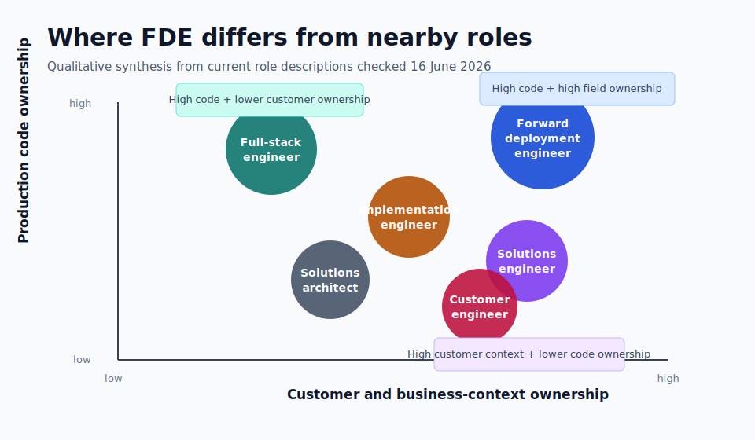

# Forward Deployment Engineer vs Full-Stack Engineer and Similar Roles

A forward deployment engineer is different from a full-stack engineer because
the FDE owns the path from an ambiguous customer or business problem to a
working production outcome. A full-stack engineer owns more of the application
stack: frontend, backend, database access, APIs, and sometimes deployment
plumbing. The overlap is real, but the center of gravity is different.

The simple distinction is this: full-stack engineering is breadth across code
layers. Forward deployment engineering is ownership across the operating
boundary.

Another distinction is employment and incentive alignment. In the stricter
definition, an FDE is a product-company engineer embedded with a client to
deploy, customize, and co-evolve the company's technology. That makes the role
different from a contractor or consultant: the FDE should be able to feed field
patterns back into the roadmap and improve the platform, not only complete a
client engagement.

That boundary is where the confusion starts. A strong full-stack engineer can
build the UI, API, database model, and backend logic for a product. A strong
FDE may also build all of those things, but the job starts earlier and ends
later. The FDE has to find the real workflow, prove the data is safe enough,
shape the smallest useful system, deploy it into the customer's environment,
watch whether users trust it, and feed repeated field patterns back into the
product or platform.

## The shortest difference

The shortest way to separate the roles is to ask what each role is expected to
protect.

| Role | What the role protects |
| --- | --- |
| Forward deployment engineer | The customer outcome across discovery, data, code, deployment, adoption, and field feedback. |
| Full-stack engineer | The application path across frontend, backend, database, API, and user-facing behavior. |
| Software engineer | A feature, service, component, platform capability, or product system inside an engineering roadmap. |
| Solutions engineer | The technical sale: demos, proof, architecture confidence, and buyer consensus. |
| Solutions architect | The technical design: architecture, cloud fit, cost, reliability, integration, and implementation direction. |
| Customer engineer | The technical customer relationship: advisory work, demos, cloud architecture, technical blockers, and adoption planning. |
| Implementation engineer | The configured or integrated customer deployment after a sale or delivery decision. |
| Consultant | The engagement outcome, which may include discovery, recommendations, implementation, change management, or delivery governance. |
| AI engineer | The AI system path: model integration, retrieval, agents, evals, guardrails, latency, cost, and reliability. |
| Product engineer | The product user outcome inside the product surface, usually for many users rather than one customer environment. |

The FDE is closest to full-stack engineering when the customer problem requires
a custom app, workflow tool, integration layer, or AI-powered internal system.
The FDE is closest to solutions engineering when the work happens before or
during enterprise evaluation. The FDE is closest to implementation engineering
when the problem is mostly configuration, integration, migration, and go-live.

The title alone does not settle it. The real test is the operating contract:
who finds the requirement, who writes the production code, who owns the
customer environment, who supports go-live, and who turns what was learned into
reusable product capability?

That operating contract exists because neither side of the traditional market
tradeoff is enough on its own. A generic SaaS product may scale but miss the
client's actual workflow. A consulting engagement may fit the workflow but fail
to become reusable software. FDE tries to bridge that gap by keeping the
engineer close to both the customer environment and the product organization.

## FDE vs full-stack engineer

A full-stack engineer can build across the application. That usually means the
user interface, backend service, API layer, business logic, database model,
authentication flow, and sometimes deployment pipeline. Full-stack development
is powerful because one engineer can reason across the visible product and the
server-side behavior behind it.

An FDE may need full-stack ability, but full-stack ability is not the whole
job. The FDE has to know why the application should exist, which business
decision it changes, whether the data can be trusted, where the system must
run, who will use it, how it will be supported, and what the customer team will
do when the output is wrong.

The difference is easiest to see in a real example.

A full-stack engineer might receive a scoped ticket:

- build a React interface for exception review
- add an API endpoint that returns prioritized exceptions
- store reviewer decisions in the database
- add tests and deploy through the existing pipeline

An FDE might receive a vague request:

- operations wants a way to know which shipment exceptions need action before
  the daily plan locks

That second request is not ready for ordinary implementation. The FDE has to
find the decision owner, trace the exception workflow, inspect the source
tables, check whether identifiers match across systems, learn which manual
overrides matter, build the tool or service, deploy it with the right access,
and watch whether planners actually trust the ranking.

The FDE may still write full-stack code. The difference is that the code is
only one layer of the responsibility.

Putting engineers next to users changes the quality of the product signal.
Instead of translating customer needs through layers of sales notes, handoff
documents, and assumptions, the FDE sees the operating problem directly, builds
against it, and turns repeated field patterns into reusable product capability.

## FDE vs software engineer

A software engineer usually works inside a product or platform roadmap. The
work may be frontend, backend, infrastructure, data, reliability, security, or
machine learning. The team may have product managers, designers, tech leads,
engineering managers, and support channels around the work.

An FDE works closer to the field problem. The FDE may not receive a clean
product requirement. The customer context may be messy. The data contract may
be undocumented. The deployment environment may be constrained by permissions,
network boundaries, procurement, security review, or legacy systems.

The software engineer's question is often:

- How do we build this feature correctly inside the product?

The FDE's question is often:

- What should be built so this customer workflow works under real operating
  conditions?

That does not make FDE more technical than software engineering. It changes the
technical shape. A conventional software engineer may go deeper on architecture,
scale, performance, platform internals, or code quality inside one system. An
FDE may go wider across business discovery, data diagnosis, integration,
customer infrastructure, production rollout, and feedback into product.

The stronger role depends on the problem. A core database engine, distributed
system, compiler, payment platform, or high-scale product service needs deep
software engineering. A messy enterprise deployment where the product only
creates value after it touches local workflow, local data, and local trust may
need FDE ownership.

## FDE vs solutions engineer or sales engineer

Solutions engineers and sales engineers usually live near the commercial
cycle. They help buyers understand whether a product can solve their problem.
They run demos, answer architecture questions, configure proof-of-concept
environments, explain technical tradeoffs, and help sales teams reach a
technical win.

The overlap with FDE is customer proximity. Both roles need strong technical
communication. Both roles translate business pain into technical shape. Both
roles may run prototypes or demos.

The difference is what happens when the buyer says yes.

A solutions engineer proves the product can work. An FDE makes the system work
inside the real customer environment.

That line can blur in startups. A single person may demo the product, scope the
workflow, write integration code, handle deployment, debug customer data, and
feed patterns back to engineering. But as the company matures, the distinction
matters. Pre-sales technical proof is not the same as production ownership.

That is why the FDE model is closer to embedded product discovery than
sales-led requirements gathering. The customer work is not only a way to win or
retain an account. It is a way to find product truth from inside the operating
environment, where risks and opportunities are changing in real time.

If the role is mostly demos, objection handling, buyer workshops, and technical
sales strategy, it is closer to solutions engineering. If the role is mostly
production code, customer embedding, go-live, data reality, and field learning,
it is closer to FDE.

In a stronger field model, solutions work, deployment strategy, and FDE work
are not collapsed into one vague customer-facing title. An Echo-style role can
own the domain narrative, stakeholder alignment, and first valuable use case,
while a Delta-style FDE owns the technical path that proves the outcome. The
boundary matters because customer desire and production proof are different
jobs.

## FDE vs solutions architect

A solutions architect designs the shape of a technical solution. In cloud
contexts, that often means choosing services, mapping requirements to
architecture, balancing cost and performance, explaining tradeoffs, and
creating a design that teams can implement.

Solutions architecture can be highly technical, but it does not always require
the architect to write production code. Some solutions architects stay close to
implementation. Others produce reference architectures, cloud designs,
migration plans, security patterns, or advisory material.

The FDE is judged more directly by whether the deployed system works in the
field. The FDE may do architecture, but architecture is not enough. The FDE
also has to close the loop through build, integration, deployment, adoption,
support, and product feedback.

The practical distinction:

- a solutions architect designs the route
- a full-stack engineer builds the application path
- an FDE carries the route through the customer's operating terrain

## FDE vs customer engineer

Customer engineer is one of the closest titles to FDE, especially in cloud and
AI companies. A customer engineer may work with technical sales teams, act as a
trusted technical advisor, run proofs of concept, troubleshoot technical
roadblocks, design cloud solutions, and help customers understand the platform.

The difference is usually the balance between technical selling, architecture,
and production build ownership.

If the role is measured by technical wins, cloud adoption, demos, workshops,
and account expansion, it is closer to customer engineering. If the role is
measured by production systems shipped inside customer workflows, it is closer
to FDE.

Some companies use customer engineer for work that looks very close to FDE.
That is why titles are weaker than role descriptions. Look for the verbs:
`demo`, `architect`, `advise`, `troubleshoot`, `implement`, `ship`, `deploy`,
`own`, `measure adoption`, and `feed product roadmap`.

## FDE vs implementation engineer

Implementation engineers work near deployment and go-live. They configure
software, integrate customer systems, migrate data, troubleshoot setup issues,
document workflows, test customer environments, and help the customer start
using the product.

This is close to FDE when the implementation requires serious engineering
judgment. The gap appears when the work is mostly predefined configuration.

An implementation engineer may be handed a signed customer, a known product,
a deployment checklist, and a configuration pattern. An FDE may have to
discover the actual operating problem, decide what should be built, write the
missing software path, and send reusable learning back to the product team.

Implementation engineering is not weak work. It can involve production
debugging, real customer systems, messy data, and high-pressure launch windows.
The difference is whether the role is mainly deploying an existing product or
creating the technical path that makes the product useful for that environment.

## FDE vs consultant

Consulting is broad. A consultant may diagnose a business problem, recommend a
strategy, manage a delivery program, configure enterprise software, write code,
train users, or run change management.

FDE overlaps with consulting because both can involve ambiguous client
problems and direct stakeholder work. The difference is engineering ownership.

If the work ends in recommendations, roadmaps, workshops, slide decks, or
handoff documents, it is not FDE. If the work includes production code,
customer data, deployment, support, and product feedback, it moves closer to
FDE.

The weak version of FDE is just consulting with a more attractive title. The
strong version is engineering-first field work where the person has enough
technical ownership to build and harden the system, not only advise around it.

## FDE vs AI engineer

AI engineers build systems that use machine learning models, LLM APIs,
retrieval pipelines, agents, evals, guardrails, monitoring, and model
integration patterns. The center of the role is the AI system.

FDEs in AI-heavy companies may do that work too. Current AI-era FDE role
descriptions often mention production LLM applications, eval-driven feedback,
agent workflows, customer infrastructure, model behavior, deployment support,
and product feedback.

The difference is that an AI engineer can work entirely inside a product team
or platform team. An FDE uses AI engineering as one part of the customer
outcome. If the real blocker is user workflow, source data, enterprise access,
latency, model trust, or deployment politics, the FDE has to handle those
layers too.

An AI engineer asks:

- How do we build a reliable AI system?

An AI FDE asks:

- How do we make this AI system useful and supportable inside this customer's
  actual workflow?

## FDE vs product engineer

A product engineer builds product features with strong attention to user
experience, product behavior, speed of iteration, and measurable user value.
This role can look close to FDE because both care about the problem, not only
the code.

The difference is the user context. Product engineers usually build for a
product surface that should serve many users or many customers. FDEs often work
inside a specific customer environment first, then identify what should become
reusable product capability.

Product engineering starts from the product. FDE starts from the field.

The best FDE work eventually becomes product engineering input. Repeated
customer deployment pain may become a connector, workflow primitive,
permission model, observability feature, admin tool, or platform abstraction.

## FDE vs data scientist, data engineer, or ML engineer

Data scientists, data engineers, and ML engineers can all overlap with FDE.
The overlap appears when the customer problem depends on messy data, prediction
logic, analytics, model behavior, or production data pipelines.

The distinction is the endpoint.

A data scientist may produce analysis, experiments, forecasts, or models. A
data engineer may build the pipeline and data platform path. An ML engineer may
productionize model training, serving, monitoring, and evaluation. An FDE may
need enough of all three to make the customer workflow change.

For example, a demand forecast is not an FDE outcome by itself. The FDE outcome
is a planning workflow where the forecast reaches the right user, at the right
time, with the right fallback behavior, trust signal, access control,
monitoring, and support owner.

## FDE vs deployment strategist

Deployment strategist is closely associated with the same field-oriented
tradition as FDE, but it often leans more toward problem framing, stakeholder
alignment, operational strategy, and deployment leadership. In some companies,
the deployment strategist and FDE work as a pair: one owns more of the
customer problem and operating change, while the other owns more of the
software path.

The exact split depends on the company. The useful distinction is simple:

- if the role mostly frames the problem and drives adoption, it is closer to
  deployment strategy
- if the role writes or directly shapes the production system, it is closer to
  FDE

In strong deployments, both kinds of work matter. A technically correct system
can fail if the operating change is mishandled. A strong deployment strategy
can also fail if the software path is brittle.

## Similar roles to forward deployment engineer

The roles most similar to FDE are:

- forward deployed software engineer
- customer engineer
- solutions engineer
- sales engineer
- implementation engineer
- professional services engineer
- technical consultant
- solutions architect
- deployment strategist
- product engineer
- AI engineer
- applied AI engineer
- ML solutions engineer
- field engineer
- developer advocate with implementation ownership

The closest match depends on which part of the FDE job is strongest.

| If the job emphasizes... | It may resemble... |
| --- | --- |
| Production code in customer environments | Full-stack engineer, software engineer, implementation engineer |
| Technical demos and buyer confidence | Solutions engineer, sales engineer, customer engineer |
| Cloud architecture and design | Solutions architect, cloud architect, customer engineer |
| AI workflows and model behavior | AI engineer, applied AI engineer, ML solutions engineer |
| Customer rollout and adoption | Implementation engineer, customer success engineer, deployment strategist |
| Business problem framing | Consultant, business analyst, product manager, deployment strategist |
| Reusable product feedback | Product engineer, product manager, platform engineer |

The best comparison is not title-to-title. It is responsibility-to-responsibility.

## The practical test

Use five questions to tell whether a role is really FDE or only adjacent to
FDE.

First, where does the work start? If it starts with a clean ticket, it is more
like software or full-stack engineering. If it starts with a messy customer
problem, it is closer to FDE.

Second, where does the work end? If it ends at a demo, design, recommendation,
or handoff, it is not full FDE. If it ends after production rollout, adoption,
support, and feedback, it is closer.

Third, who owns the data reality? If someone else validates source data,
lineage, joins, freshness, and failure modes, the role is narrower than FDE.

Fourth, who writes or directly shapes the production software? If the person
only advises, sells, or configures, the role may be valuable but it is not
engineering-first FDE.

Fifth, does field learning return to the product? If every customer deployment
becomes a private one-off, the company is doing custom services. If repeated
patterns become product capability, platform abstraction, deployment tooling,
or engineering knowledge, the work is closer to strong FDE.

## What this means for someone coming from full-stack engineering

A full-stack engineer is already close to the implementation part of FDE. The
missing layer is usually not another framework. The missing layer is field
ownership.

To move toward FDE, a full-stack engineer has to prove they can:

- turn vague business language into a buildable workflow requirement
- inspect real data before trusting the system
- build across the UI, API, backend, integration, and deployment path
- explain tradeoffs to non-engineers without hiding technical risk
- deploy with permissions, secrets, logs, monitoring, and support handled
- learn from user behavior after go-live
- turn repeated customer problems into reusable product ideas

That is why FDE can sound like full-stack engineering but is not the same
thing. Full-stack is the application range. FDE is the operating range.

For the full role definition, the deeper page on the [job of a forward
deployment engineer](../index.md) covers the ownership model in detail.
For the capability breakdown, the [forward deployment engineer skills](../skills.md)
page separates business discovery, data diagnosis, software implementation,
deployment, AI evaluation, and product judgment.

The practical distinction is this: a full-stack engineer can build the system
across the stack; a forward deployment engineer has to make the system work
across the customer's reality. When the business workflow, data assumptions,
software path, deployment environment, user trust, and product feedback all
have to hold together, the role has moved beyond full-stack engineering and
into [forward deployment engineering](../../index.md).

