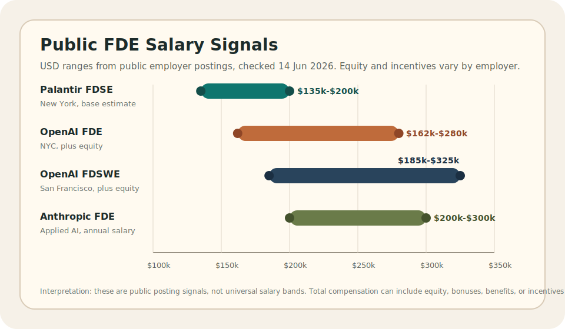
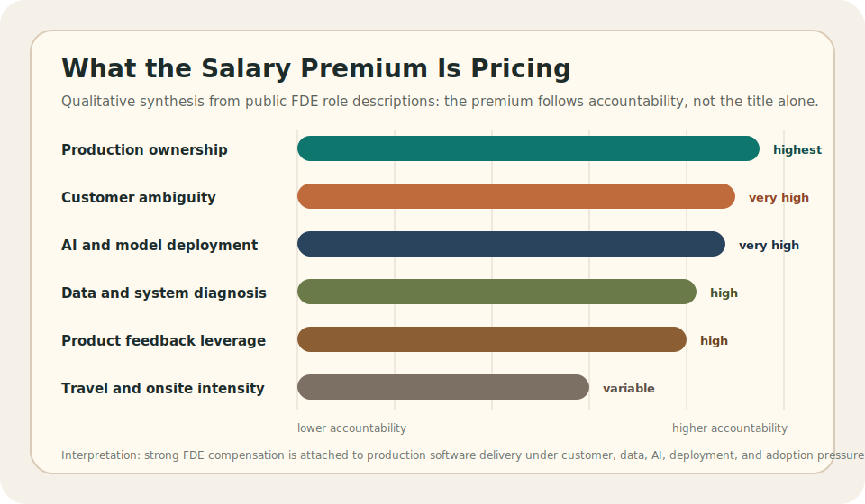

# What Is the Job of a Forward Deployment Engineer?

A forward deployment engineer is a software engineer who takes an unclear
customer or business problem and turns it into working production software.
The work usually starts before there is a clean ticket, stable data contract,
finished product requirement, or agreed deployment plan. It ends when users
can rely on the system in their actual workflow, not when a prototype looks
good in a demo.

That means the role is hands-on. An FDE writes code, reads logs, traces data
quality issues, designs integrations, handles access and deployment
constraints, and keeps talking to the business team until the software matches
the real operating problem.

The difference from a normal software role is the amount of ownership at the
boundary. A regular engineer may receive a scoped feature. An FDE often has to
find the real requirement, prove the data is usable, build the service or tool,
deploy it, support adoption, and feed the pattern back into the product.

## The job in one sentence

The job of a forward deployment engineer is to embed near the user problem,
identify the operational decision that matters, build the technical system
that improves it, deploy that system into the real environment, and convert
field learning into product or platform leverage.

Every phrase in that sentence matters.

`Embed near the user problem` means the FDE works close enough to see the real
workflow, not only the documented process.

`Identify the operational decision` means the FDE narrows the work to a
decision, action, exception, routing step, forecast, recommendation, or
control point that changes what people do.

`Build the technical system` means the FDE writes or directly shapes software,
data logic, integrations, model workflows, internal tools, or production
services.

`Deploy into the real environment` means identity, permissions, latency,
secrets, logging, monitoring, rollout, rollback, and support are part of the
job.

`Convert field learning into leverage` means the work should not remain a
private one-off workaround if the pattern can become product capability,
platform abstraction, deployment playbook, or reusable engineering knowledge.

## Why this job exists

Forward deployment engineering exists because important operational problems
often break the normal separation between business analysis, data science,
software engineering, cloud deployment, and product management.

In a clean delivery model, a business team writes requirements, a data team
validates the data, an engineering team builds the system, a platform team
deploys it, and users adopt it. In real organizations, that sequence often
fractures.

The business requirement may be a symptom rather than the real decision. The
system of record may be incomplete. The metric may mean different things to
different teams. The user workflow may depend on undocumented spreadsheets,
manual overrides, Slack messages, or exception handling that never appears in
the process map. The prototype may work in a controlled environment and fail
once it meets access control, latency, data freshness, model drift, or
production support.

The FDE job exists at that fracture point. The role carries the problem across
the layers until the system is useful under operating conditions.

## What the FDE actually owns

The FDE owns the path from problem ambiguity to production outcome.

That ownership includes:

- the decision or workflow the system must improve
- the data contract the system depends on
- the software or model path that encodes the logic
- the integration surface where the output enters the user's work
- the deployment environment where the system runs
- the observability needed to know whether the system is healthy
- the adoption path that determines whether users trust it
- the feedback loop that turns field learning into reusable capability

The job is not finished when the analysis is correct. It is not finished when
the prototype runs. It is not finished when the code merges. It is not even
finished at first deployment if nobody trusts, owns, monitors, or supports the
system.

The job is finished when the business workflow, data logic, software path,
deployment environment, and support owner hold together under real use.

## The operating workflow

The FDE workflow is a control loop, not a waterfall.

The first move is problem framing. The FDE identifies the user, action,
system, timing, constraint, and consequence. A weak request says, "build a
dashboard." A stronger engineering requirement says, "show the warehouse
planner which capacity exception needs action before the shift is locked." The
second sentence can be built against because the owner, workflow, time window,
and failure cost are visible.

The second move is workflow discovery. The FDE maps the triggering event,
systems of record, handoffs, manual checks, exception paths, approvals, and
final decision. This step separates the process people describe from the
process they actually follow under pressure.

The third move is data interrogation. The FDE tests freshness, joins,
identifiers, null behavior, lineage, duplication, metric definitions, schema
drift, and hidden manual correction. A table can be queryable and still be
unsafe for production logic.

The fourth move is solution scoping. The FDE chooses the smallest production
path that can change the workflow without creating hidden debt. The answer may
be a pipeline, API, internal tool, workflow integration, model-backed service,
agent workflow, or small full-stack application.

The fifth move is implementation. The FDE builds where the workflow needs
leverage. If trust is the problem, the build may need explanation and lineage.
If handoff delay is the problem, the build may need routing and integration.
If operational overload is the problem, the build may need prioritization,
alerting, and exception handling rather than another passive dashboard.

The sixth move is deployment. The FDE gets the system into the real
environment with authentication, authorization, secrets, network access,
configuration, monitoring, rollback, and support expectations handled
properly.

The seventh move is production learning. The FDE watches usage, support
tickets, incidents, false positives, false negatives, latency, manual
overrides, user trust, and data quality. These signals decide whether the
system should be hardened, changed, generalized, or retired.

## Day-to-day responsibilities

The day-to-day work looks fragmented because the blocker moves.

On one day, the FDE may clarify a business rule with an operations lead,
discover that two systems use incompatible identifiers, and write integration
code to move a decision into the user's workflow. On another day, the same FDE
may debug a permission issue, review logs, adjust a rollout, or explain a
model limitation to stakeholders who need to trust the output.

The responsibilities usually fall into six work modes.

### Field discovery

Field discovery means working close enough to the customer or business team to
understand what actually happens. The FDE identifies the real user, the real
decision, the real workaround, the real exception path, and the real
consequence of failure.

This mode requires interviews, observation, workflow mapping, ticket reading,
system tracing, and the ability to convert vague language into requirements
that engineers can build and test.

### Data and system diagnosis

Data diagnosis means proving whether the system can rely on the available
data. The FDE checks source systems, joins, freshness, identity resolution,
lineage, data quality, metric definitions, event timing, and edge cases.

This mode prevents bad automation. If the data contract is weak, the software
will only move broken business logic faster.

### Product and solution shaping

Solution shaping means deciding what should be built, what should not be
built, and what should become reusable. The FDE balances customer specificity
against product leverage.

This mode requires judgment. Some work should be a custom deployment. Some
should become platform capability. Some should remain a prototype. Some should
be rejected because the request would create brittle, unsupported complexity.

### Software implementation

Implementation means writing or directly shaping production-grade software.
The FDE may build APIs, services, data pipelines, internal tools, integration
layers, evaluation harnesses, or full-stack applications.

In AI-heavy roles, this can include retrieval pipelines, tool-use flows, agent
boundaries, prompt and version management, eval datasets, guardrails, cost
controls, latency controls, and monitoring for model behavior after launch.

### Deployment and production ownership

Deployment means making the system survive the real environment. The FDE has
to think about authentication, authorization, secrets, cloud configuration,
network boundaries, data permissions, logs, metrics, tracing, rollout,
rollback, incident response, and support ownership.

This is the boundary that separates a useful prototype from an operational
system.

### Field feedback and product leverage

Field feedback means sending what was learned back into product, platform, and
engineering direction. Repeated integration pain may become a connector.
Repeated configuration work may become a platform abstraction. Repeated user
distrust may become an explainability feature. Repeated support failure may
become better observability.

This mode is where FDE work stops being bespoke delivery and starts compounding
into product advantage.

## Skills required for the job

The skill stack is wide because the job crosses boundaries. The FDE does not
need to be the deepest specialist in every layer, but the role requires enough
depth to prevent the work from breaking between layers.

This section is the compressed version. The deeper [forward deployment
engineer skills](skills.md) page separates the skills into practical
capabilities, shows what each one proves, and explains how a beginner can
build evidence for the role.

| Skill area | What the skill does in the job |
| --- | --- |
| Business analysis | Converts vague requests into decisions, owners, constraints, tradeoffs, and measurable workflow changes. |
| Data judgment | Tests whether fields, joins, freshness, metrics, and lineage are safe enough for production logic. |
| Software engineering | Builds maintainable APIs, services, tools, pipelines, integrations, and user-facing systems. |
| Product judgment | Separates one-off customer pain from reusable product capability or platform abstraction. |
| Cloud and deployment | Handles identity, secrets, configuration, observability, rollout, rollback, and support expectations. |
| AI deployment | Designs model workflows, retrieval, tool use, evals, guardrails, monitoring, cost control, and safety boundaries. |
| Communication | Translates business context to engineers and technical constraints to stakeholders. |
| Agency under ambiguity | Moves work forward without waiting for perfect requirements, while still preserving technical discipline. |

The strongest FDEs are not valuable because they know many tools. They are
valuable because they preserve the operating context while building.

## Salary signals and compensation research

Forward deployment engineering salaries are high when the role carries real
production accountability. The salary premium is not paid for being a general
communicator between business and engineering. It is paid for a harder
operating contract: diagnose an ambiguous customer environment, build the
system, deploy it safely, support the rollout, and turn the field pattern into
product or platform leverage.

Public employer postings checked on 14 June 2026 show that FDE-related roles
in the United States can sit from the mid-$100k base-salary range into the
low-$300k salary range, with equity or long-term incentives sometimes offered
separately. These numbers are not universal pay bands. They are point-in-time
signals from public postings, and they mostly reflect senior, customer-facing,
AI or data-heavy engineering roles in expensive US technology markets.

| Public role signal | Posted compensation signal | What the range is pricing |
| --- | --- | --- |
| Palantir Forward Deployed Software Engineer | USD 135k-200k estimated salary, with possible restricted stock, sign-on bonus, and future incentives excluded from the base estimate | Customer-side delivery, business-critical data, AI-assisted operations, custom applications, stakeholder engagement, and project ownership from ideation to deployment. |
| OpenAI Forward Deployed Engineer, NYC | USD 162k-280k plus equity | End-to-end frontier-model deployments, discovery, technical scoping, system design, production rollout, adoption measurement, eval-driven feedback, and field input into product and model roadmaps. |
| OpenAI Forward Deployed Software Engineer, San Francisco | USD 185k-325k plus equity | Deep customer embedding, full-stack solution design, project plans for prototypes and production deployments, hands-on customer infrastructure work, and codified delivery patterns. |
| Anthropic Forward Deployed Engineer, Applied AI | USD 200k-300k annual salary | Production applications using Claude models, MCP servers, sub-agents, agent skills, enterprise deployment support, repeatable AI deployment patterns, and frontier AI implementation judgment. |

The pattern is clear: the market does not price the title alone. It prices the
combination of customer ambiguity, production software, AI deployment, data
judgment, delivery pressure, and product feedback. A role that only configures
software or writes advisory documents should not be compared directly with
roles that own production systems inside strategic customer environments.

This is why salary research needs the job description beside the number. A
USD 300k range is not evidence that every FDE role pays like a senior AI
platform engineer. It is evidence that some employers attach senior-engineer
compensation to roles where the FDE is expected to ship production software,
handle deployment ambiguity, work directly with customers, and convert field
learning into reusable product capability.

## What good FDE work looks like

Good FDE work has concrete signs.

The business problem is expressed as a decision or workflow change, not a tool
request.

The data assumptions are written down, tested, and exposed where they affect
trust.

The software path is small enough to ship but strong enough to maintain.

The deployment plan includes permissions, secrets, logs, metrics, rollback,
and support ownership.

The user can explain when to trust the system and when not to trust it.

The field learning produces reusable product, platform, or delivery knowledge.

## What bad FDE work looks like

Bad FDE work often looks fast at the beginning and expensive later.

Common failure modes include:

- building against the stakeholder's first request instead of the real
  operating decision
- trusting sample data that does not match production reality
- shipping a brittle custom script with no owner, tests, logs, or monitoring
- hiding data uncertainty behind a confident interface
- ignoring permissions, lineage, compliance, or support burden
- creating customer-specific branches that cannot be maintained
- treating deployment as someone else's problem
- failing to turn repeated field patterns into product learning

The role is not about heroic one-off delivery. It is about speed with enough
engineering discipline to avoid leaving hidden operational debt behind.

## How the job differs from nearby roles

A business analyst may define the process but stop before implementation.

A data scientist may build a model but stop before production integration.

A software engineer may ship clean code while staying away from the real
customer workflow.

A solutions engineer may design, configure, or validate a solution but may not
own the full production path after launch.

A consultant may frame the problem and help deliver the project but may leave
before the system proves itself under live use.

The FDE job differs because it keeps accountability across the boundary. The
same role stays close to the decision, the data, the code, the deployment, the
user, and the production consequence.

## A concrete example

Take a warehouse forecasting problem.

The visible request may be simple: forecast demand so the operation can
allocate labor and transport capacity. The FDE job begins when that request is
turned into a production requirement: predict which site, shift, and capacity
constraint requires action before the staffing plan is locked.

That requirement exposes the real engineering work. Historical demand may
arrive late. Sites may use inconsistent SKU mappings. Promotions may be
corrected manually outside the primary system. Shift planners may trust some
fields and ignore others. Dispatch teams may rely on a workaround that the ERP
does not represent.

The FDE has to test the source data, define fallback behavior, choose the
forecasting path, expose the output where planners act, deploy the system with
the right permissions, monitor forecast error and usage, and watch whether
planners override or trust the result.

The deliverable is not the model. The deliverable is a production decision
system that improves planning without creating a support burden.

## The practical test for the job

The practical test is whether the same piece of work connects these layers:

- the business decision that needs to improve
- the workflow people actually follow
- the data assumptions and failure modes
- the software path that carries the logic
- the deployment environment where it runs
- the production signals that show whether it is trusted
- the owner who is accountable after launch
- the product learning that should be reused

If those layers are disconnected, the work may still be useful, but it is not
full forward deployment engineering.

That is the job of a forward deployment engineer: convert ambiguity into a
production system, keep ownership across the boundary, and make the field work
compound into better product capability.

For the broader FAQ version of the topic, return to [Forward Deployment
Engineering](../index.md).

