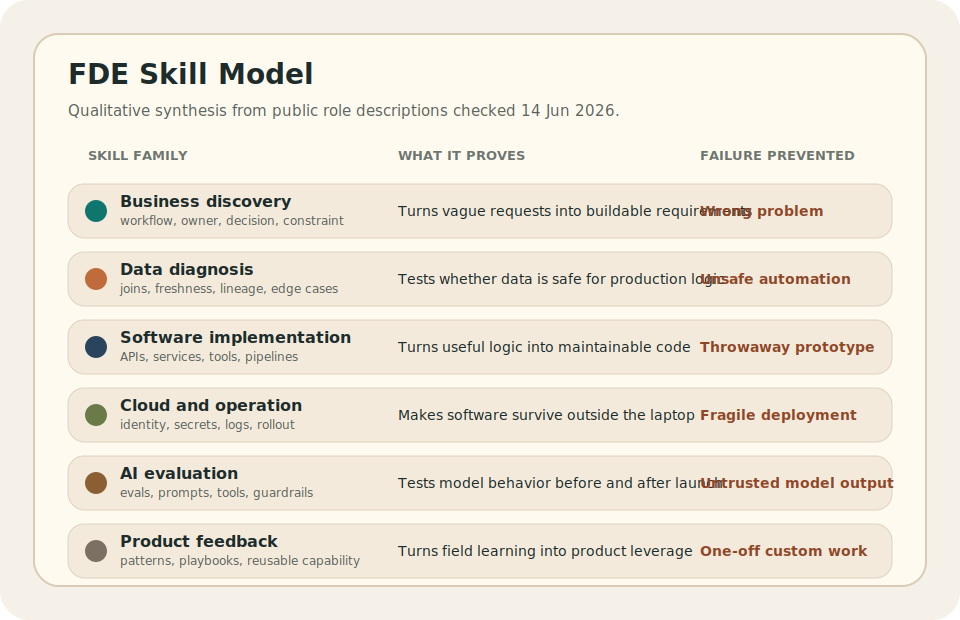

# Forward Deployment Engineer Skills

Forward deployment engineer skills are the capabilities that let an engineer
move from an unclear business problem to production software that real users
can trust. The role is not defined by one tool. It is defined by the ability to
keep business context, data constraints, software quality, deployment risk, and
user adoption connected through the same piece of work.

The useful way to think about the skill set is not, "What technologies should
an FDE know?" The stronger question is, "What failure does each skill prevent?"
A good FDE skill stack prevents the work from failing at the boundaries:
requirements, data, code, deployment, adoption, and support.

## The skills are connected, not separate lanes

An FDE does not use business analysis, data science, software engineering, and
cloud deployment as four separate careers stitched together. The value comes
from moving between them without losing the operating problem.

If the stakeholder asks for a dashboard, the FDE has to find the decision
behind the dashboard. If the data looks usable, the FDE has to test whether it
is complete, fresh, joined correctly, and safe for automation. If the prototype
works, the FDE has to turn it into software with authentication, logging,
rollback, and support. If users ignore the system, the FDE has to understand
why the output failed to fit the workflow.

That is why the skills should be judged by production transfer. A skill is
useful when it helps the work survive the move from idea to live system.

## What current FDE roles signal about skills

Public forward deployment engineer and forward deployed software engineer role
descriptions checked on 14 June 2026 show a consistent skill pattern. Palantir
emphasizes customer-facing execution, large-scale data, architecture,
front-end frameworks, cloud infrastructure, custom applications, and strong
programming in languages such as `Python`, `Java`, `C++`, `TypeScript`, or
`JavaScript`. OpenAI emphasizes production deployment of frontier models,
full-stack systems, customer embedding, production adoption, eval-driven
feedback, and production-grade code across frontend and backend stacks.
Anthropic emphasizes production applications with Claude models, MCP servers,
sub-agents, agent skills, enterprise deployment support, advanced prompt
engineering, evaluation frameworks, Python, TypeScript, and deployment at
scale.

Those signals matter because they separate FDE skill from generic technical
fluency. The market is not asking only for a programmer who can talk to
customers. It is asking for someone who can move through customer discovery,
data diagnosis, software delivery, AI evaluation, deployment support, and
product feedback without dropping context.

The practical skill model is therefore boundary-based. Each skill exists to
stop a specific failure at the handoff between business intent and production
software.

## Business and workflow discovery

Business discovery is the skill of finding the real operating problem before
writing code. It means identifying who makes the decision, what action changes,
which constraint matters, what happens if the system is wrong, and how the
workflow actually runs under pressure.

The practical outputs are clear requirements, workflow maps, decision rules,
user stories, exception paths, and acceptance criteria that engineers can
build against. A weak FDE repeats the stakeholder's first request. A stronger
FDE turns that request into a testable workflow change.

This skill prevents the classic failure where the software is technically
correct but attached to the wrong business problem.

## Data diagnosis

Data diagnosis is the skill of proving whether the data can support the
system. An FDE needs to inspect source systems, identifiers, joins, freshness,
lineage, null behavior, duplicated records, manual overrides, and schema drift
before trusting the output.

The practical tools are usually `SQL`, notebooks, scripts, profiling queries,
lineage checks, reconciliation tests, and small validation datasets. The
important part is not only producing analysis. The important part is deciding
whether the data is safe enough for production logic.

This skill prevents bad automation. If the data contract is weak, production
software will only make the wrong decision faster and more confidently.

## Software implementation

Software implementation is the skill of turning the useful logic into
maintainable code. An FDE may build APIs, backend services, data pipelines,
internal tools, workflow automations, evaluation harnesses, or full-stack
applications.

The practical standard is production-readiness. Code should have clear
interfaces, tests where risk is high, readable structure, version control,
review discipline, error handling, and a deployment path. A script can be
useful during discovery, but it should not quietly become business-critical
infrastructure with no owner.

This skill prevents the gap between a good idea and a system that can be
maintained after the first launch.

The technical stack depends on the employer, but the recurring public signals
are clear: `Python` for data, automation, backend services, and AI workflows;
`SQL` and relational databases for interrogation and production data access;
`TypeScript` or `JavaScript` for full-stack tools; and normal engineering
practice around Git, code review, tests, interfaces, and deployment.

## Cloud and production operation

Cloud and production operation is the skill of making software survive outside
the local machine. An FDE needs enough deployment knowledge to handle
environments, secrets, identity, access control, network boundaries,
configuration, logs, metrics, tracing, rollback, and support ownership.

The practical tools depend on the company, but the concepts are stable:
containers, CI/CD, cloud services, permissions, observability, incident
response, and release management. The FDE does not need to replace a platform
engineer, but the FDE must understand enough to avoid throwing unfinished work
over the wall.

This skill prevents demo-quality software from becoming a fragile production
burden.

## AI deployment and evaluation

AI deployment is becoming a more important FDE skill because many customer
problems now involve model behavior, retrieval quality, tool use, agent
boundaries, latency, privacy, cost, and reliability.

For AI-heavy FDE work, the practical skill set includes prompt and version
management, retrieval pipelines, evaluation datasets, regression tests,
guardrails, human review paths, monitoring, and failure analysis. The FDE has
to know when a model answer is useful, when it is unsafe, and when the system
needs a deterministic rule instead of another model call.

This skill prevents AI prototypes from being mistaken for dependable
production systems.

## Communication and product judgment

Communication is not soft decoration in this role. It is the skill of keeping
technical reality and business reality synchronized. The FDE has to explain
constraints without hiding behind jargon, write down tradeoffs, show why a
data assumption matters, and tell stakeholders when a request creates
unacceptable operational risk.

Product judgment is closely related. Some field work should stay custom. Some
should become a reusable product capability. Some should become a platform
abstraction. Some should be rejected because it creates unsupported
complexity.

This skill prevents the FDE from becoming a ticket-taker, a one-off custom
builder, or an engineer who ships code without understanding the adoption
problem.

## Skill depth matrix

The FDE does not need maximum depth in every skill, but each layer needs
enough depth to stop the work from breaking.

| Skill layer | Minimum useful depth | Strong evidence |
| --- | --- | --- |
| Business discovery | Can turn vague requests into decisions, users, constraints, and acceptance criteria. | A written problem brief that explains the workflow, failure cost, and decision owner. |
| Data diagnosis | Can validate fields, joins, freshness, lineage, and edge cases before building. | A reproducible data-quality check or validation notebook tied to the production requirement. |
| Software implementation | Can build maintainable services, scripts, pipelines, APIs, or tools. | A deployed app or service with clear interfaces, error handling, and version control. |
| Cloud deployment | Can move code into a live environment with configuration, secrets, and observability. | A working deployment with logs, metrics, rollback notes, and support assumptions. |
| AI evaluation | Can test model behavior against examples, failure modes, cost, latency, and safety. | An eval harness or test set that catches regressions before release. |
| Product feedback | Can identify patterns that should become reusable product or platform capability. | A field-learning note that turns repeated customer friction into a product improvement. |

## How to build the skill set

The best way to build FDE skill is to complete small projects that cross the
whole delivery path. A narrow project is better than a large unfinished one if
it proves the full loop.

A strong beginner project should include:

- a realistic business problem with a named user and decision
- messy input data that requires validation
- written assumptions and known failure modes
- backend logic, API, pipeline, or workflow automation
- a small user interface or operational output
- deployment to a cloud or hosted environment
- logs, basic monitoring, and a short rollback plan
- a final write-up explaining what would fail in production

This kind of project shows the skill pattern better than a clean tutorial. It
proves that the person can connect business analysis, data judgment, software
engineering, and deployment discipline in one system.

## The practical test

The practical test for FDE skills is simple: can the person take an ambiguous
problem, find the real requirement, prove the data is usable, build the system,
deploy it, explain the tradeoffs, and learn from production feedback?

If the answer is no, the person may still have useful business, data,
software, or cloud skills. If the answer is yes, the person is closer to the
actual skill profile described in the [job of a forward deployment
engineer](index.md).

