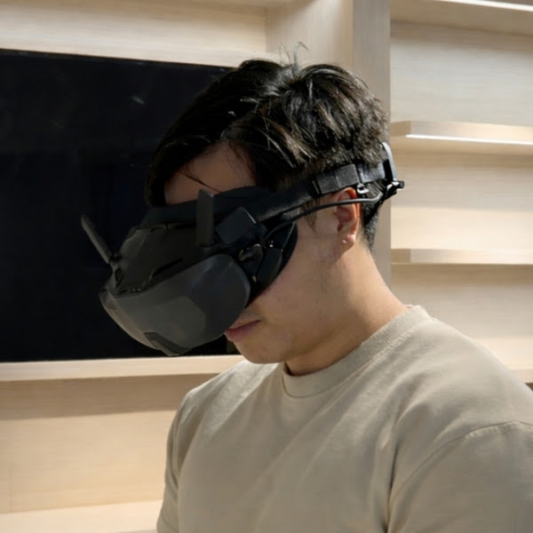

<section class="hero" id="who-i-am">
  

    
Rizwan Ye's personal website

    <h1>iRizwan</h1>
    

      I write about building business-aware, data-informed, production-ready
      software. This is an open-source record of who I am, what I am building,
      and what I am learning in public.
    

    

      <a class="md-button md-button--primary" href="#who-i-am">Who I Am</a>
      <a class="md-button" href="#what-i-write-about">What I Write About</a>
    

  

  

    
  

</section>
